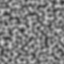

# Simple 2D Perlin Noise Generator

Perlin noise is a procedural texture generation algorithm developed by Ken Perlin in the early 1980s. It is widely used in computer graphics to create natural-looking, pseudo-random textures, terrains, and patterns. The algorithm is based on a structured grid and a smooth interpolation method to generate coherent, non-repeating values.


## How to do it

### 1. Define a Grid: The 2D space is divided into a grid of squares.

```python
def create_gradient_grid(grid_width, grid_height):
    """Crée une grille de vecteurs gradients aléatoires"""
    grid = []
    for y in range(grid_height):
        row = []
        for x in range(grid_width):
            # Angle aléatoire
            angle = random.random() * 2 * math.pi
            # Convertir en vecteur (x, y)
            gradient = (math.cos(angle), math.sin(angle))
            row.append(gradient)
        grid.append(row)
    return grid
```
### 2. Generate Gradients: Generating gradient vectors at grid intersections.

The function:
```python
def dot_grid_gradient(grid, grid_corner_x, grid_corner_y, pixel_grid_x, pixel_grid_y):
    """
    grid_corner_x, grid_corner_y: indices du coin dans la grille (entiers)
    pixel_grid_x, pixel_grid_y: position du pixel en coordonnées de grille (floats)
    """
    # Vecteur du coin vers le pixel
    dx = pixel_grid_x - grid_corner_x
    dy = pixel_grid_y - grid_corner_y
    
    # Gradient du coin
    gradient = grid[grid_corner_y][grid_corner_x]
    
    # Produit scalaire
    return dx * gradient[0] + dy * gradient[1]
```

In the main function:
```python
# 1. Trouver dans quelle cellule on est
grid_x = pixel_x / grid_size  # Position en coord de grille (float)
grid_y = pixel_y / grid_size

# 2. Les 4 coins de la cellule
x0 = int(grid_x)      # Coin gauche
y0 = int(grid_y)      # Coin haut
x1 = x0 + 1           # Coin droit
y1 = y0 + 1           # Coin bas

# 3. Calculer les 4 produits scalaires
dot_tl = dot_grid_gradient(grid, x0, y0, grid_x, grid_y)  # top-left
dot_tr = dot_grid_gradient(grid, x1, y0, grid_x, grid_y)  # top-right
dot_bl = dot_grid_gradient(grid, x0, y1, grid_x, grid_y)  # bottom-left
dot_br = dot_grid_gradient(grid, x1, y1, grid_x, grid_y)  # bottom-right

```

### 3. Interpolating these dot products to produce the final noise value.

The functions:
```python
def smoothstep(w):
    if (w <= 0.0):
        return 0.0
    
    if (w >= 1.0):
        return 1.0
    
    return w * w * (3.0 - 2.0 * w)

# Fonction d'interpolation lisse entre a0 et a1
# Le poids w doit être dans l'intervalle [0.0, 1.0]
def interpolate(a0, a1, w):
    return a0 + (a1 - a0) * smoothstep(w)
```

In the main function:
```python
# 5. Interpoler les 4 valeurs
# Poids pour l'interpolation
sx = grid_x - x0
sy = grid_y - y0

# Interpolation horizontale
ix0 = interpolate(dot_tl, dot_tr, sx)
ix1 = interpolate(dot_bl, dot_br, sx)
        
val = interpolate(ix0, ix1, sy)
```

###4. Normalize the output value to create my final image
```python
# 6. Normaliser de [-1,1] vers [0,255]
noise = normalize_value(val, -1, 1)
```

### Finally
You can see the source code to see how I created the images without any libraries, except for the png final output. So you can write it in any language this code can easily adapt, I only used Lists.

## Code itself

I have to translate commentaries, and rearrange the code architecture. (eg: the normalize function)

I'll also look for optimizations.

## Screenshots



